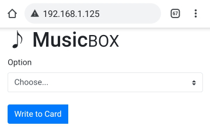

# rfid-musicbox

Create an easy way for your kids (or you!) to play music through your Sonos speakers by combining the excitement of RFID, ESP8266, Spotify & Sonos.

This project was built to predominantly allow my kids to play music, using simple RFID cards tapped against a reader to allow them to play the songs that they love without me being around.

1. [Repository File Structure](#repository-file-structure)
2. [Requirements](#requirements)
3. [Hardware](#hardware)
4. [Installation/Build](#installationbuild)
5. [Setup](#setup)
6. [Usage](#usage)
7. [RFID Cards](#rfid-cards)
7. [References](#references)

## Repository File Structure
- /Fritzing - sketch of the wiring diagram
- /html - reference html of the pages served from the musicbox webserver
- /images - supporting images for documentation & build
- /src - source files for the project

## Requirements
This project should be extendable to additional music services, but was built to support playing Spotify songs through a network connected Sonos speaker. So at a minimum you will need:
1. Spotify Premium subscription
2. At least one Sonos speaker, connected to the same wifi network
3. 1 x NodeMCU ESP8266 board - I suggest the NodeMCU v3 Compatible ESP8266 CH340 Board, and make sure you check the version
4. 1 x MFRC-522 RFID reader board - you can sometimes pick up a kit for this that includes cables, and an RFID card
5. 7 x jumper wires to connect the MFRC-522 to the NodeMCU board
6. RFID cards - as many as you need, but at least one for testing. I bought a pack of 20 to start
7. 1 x Micro USB cable, and 1 USB Power Supply - I don't think the power requirements of the NodeMCU are that great, but your smartphone power supply will easily do

There are a few additional items I purchased for my particular set-up:
1. Something to put the assembled electronics in to. I used a simple plastic project box from a local electronics supplier.
2. A Micro USB 5Pin Male to Female w/Screw Hole Panel. I used this to put a female USB plug on the outside of the project box, and make it easier to unplug/move as needed.

## Hardware
To start with, you'll need to connect the electronics as shown below, or detailed in the [Fritzing wiring diagram](Fritzing/RFID-Musicbox.fzz).

Once connected, connect the Micro USB cable and power supply to the NodeMCU board.

## Installation/Build
The source code for this project was originally written uisng VS Code, and compiled using the [Platform IO](https://platformio.org/) plugin. If you'd prefer to use the Arduino IDE, a quick Google search should show you how to (relatively) easily adapt the source files to work as an .ino format.

*Note: Before you start the below steps, make sure your NodeMCU/ESP8266 board is connected to and powered by the USB port of your computer, not to the USB Power Supply.*

If you have already have VS Code installed:
1. Install [Platform IO IDE for VS Code](https://platformio.org/install/ide?install=vscode)
2. Add a new workspace using the **rfid-musicbox** folder
3. Build and upload the firmware using the IDE [this guide](https://docs.platformio.org/en/latest/integration/ide/vscode.html#ide-vscode) is helpful to get started

If you just want to install Platform IO to run on the command line:
1. Install [Platform IO Core](https://platformio.org/install/cli)
2. Open a command line prompt
3. Change to the **rfid-musicbox** folder
4. Run `platformio run --target upload`

By this point, you should have compiled the firmware and uploaded it to the NodeMCU.

## Setup
1. After the firmware is uploaded and installed, look for a new wifi hotspot named `musicbox_setup` using your phone or computer
2. Connect your device to the wifi hotspot, using the password `musicbox_setup`
3. The hotspot should automatically connect you using a captive portal style web page, otherwise just point your browser to the IP `http://192.168.4.1/`
4. Enter the details of/select your home Wifi network (along with network password) in the provided form, then click save
5. The rfid-musicbox should now try to connect to your home Wifi network
6. After a few seconds (/minutes) try to connect to `http://musicbox.local/` using your browser

*Note: If you use an Android phone to connect to the ESP8266, you might find you have trouble connecting due to inconsistent support for mDNS in Android phones. As a workaround, try connecting using the IP address of the device which you can find using your Router or using an app like [Fing](https://www.fing.com/products/fing-app)*

## Usage
To start with, you'll need to assign a song to an RFID card. The URI information to access the song is stored on the RFID card, so you should be able to use one card to control multiple NodeMCUs with the same song.

To programme a card with a song:
1. Point your web browser to `http://musicbox.local/` (see the Note in [set-up](#setup) if you can't connect to this URL from your device)

2. Select `Play Item` from the `Option` menu

3. Click on the `Open Spotify Web Player` link to open a new browser page to the Spotify web player

4. Search for the song you wish to write to the card in the Spotify web player
5. Hover over the selected song and click on the 3 dots  towards the right to open the menu
6. Select `Copy Song Link` to copy the link to the song to your clipboard

7. Close the window/navigate back to the browser page for the NodeMCU
8. Copy the song URL in to the `Playback URL` box
9. Click on `Write to Card`. You have 10 seconds to hold the RFID card you want to programme against the RFID reader/writer.

## RFID Cards
You can 'programme' an RFID card to start 1 of 4 different actions:
1. Play Item - play a song through the currently selected speaker
2. Set Audio Destination - change which Sonos speaker plays the next song
3. Stop/Pause Playback - pause/stop playback through the currently selected speaker
4. Lock System - lock and unlock the system from reading RFID cards (except a Lock card)
   - Note: 'locking' the system doesn't persist over reboots, so if the power is lost then the device will be unlocked again

All of this is done through the web interface.

To make the cards be easy to use for the kids, I used some colourful images sourced online that closely reflect the song title. These were printed out (using a standard printer), cut out, stuck to the cards using a spot of glue, and finally laminated to make them more durable. They work fantastically, and after a year are still looking like new.

I can't share the images I used, but I've included a [template file](images/card_template.afphoto) that you can use to size your images correctly for printing out.

## References
I used a lot of different references to build this project, and am thankful to a massive amount of online resources. Key resources I found extremely helpful included:
- https://lastminuteengineers.com/how-rfid-works-rc522-arduino-tutorial/ - a great reference on how RFID works, and how to combine it with an Arduino or equivalent device
- https://github.com/TheNitek/RfidShelf - awesome project, working to build an RFID mp3 player in to a shelf, which might be a good solution if you don't use Sonos or Spotify
